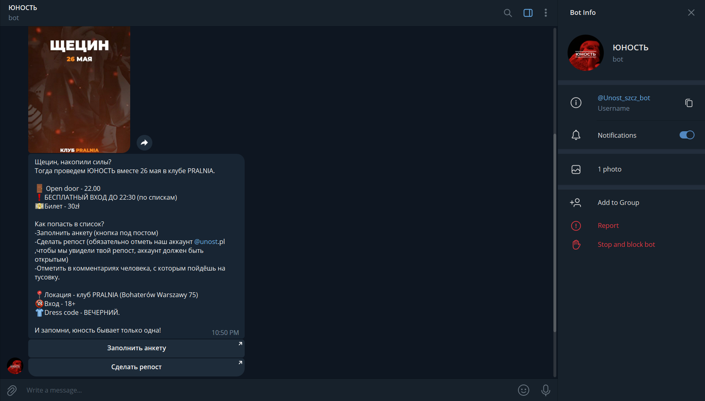
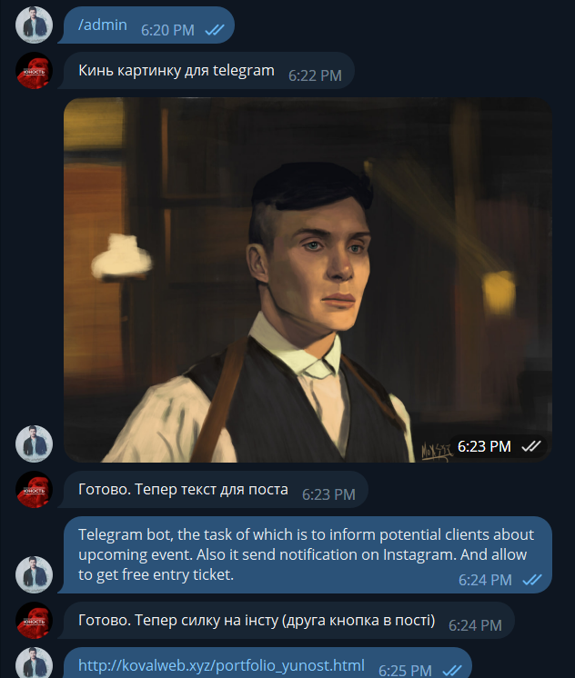
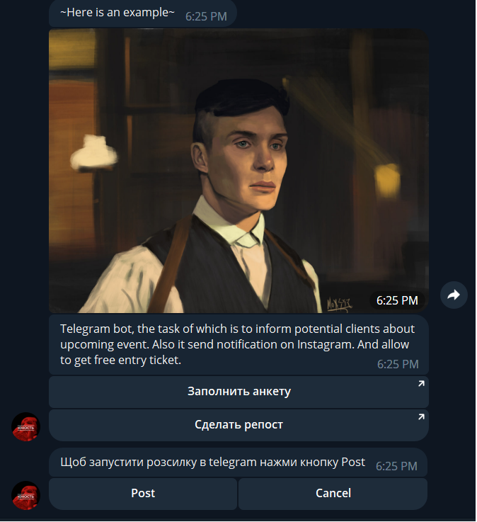

# Yunost

## Description
Telegram bot, the task of which is to inform potential guests about upcoming event.
Also it send notification on Instagram. 
List of users it get from cloud Google Sheet by API. 
And also he allow to get free entry ticket for party.

## Screenshots

## Technologies used
- Python
- aiogram
- Selenium
- Google Cloud API

## Installation

1. **Install Python**: Download and install Python (3.8+) from the official website.

2. **Install Mozilla Firefox**: Download and install Firefox browser from the official website. Install it on system **not** virtual environment!

3. **Install Requirements**: Run `pip install -r requirements.txt` in your command line to install the required dependencies.

4. **Deploy Google Spreadsheet**: Set up your spreadsheet according to your requirements.
	- https://www.youtube.com/watch?v=bu5wXjz2KvU

5. **Set Environment Variables**: Set the following environment variables:
   - `TOKEN` = bot_token_fron_botfather
   - `INSTA_LOG` = login_for_instagram_account
   - `INSTA_PASS` = password_for_instagram_account

5. **Run main.py**: Execute `python main.py` in your command line to run the main Python script.

