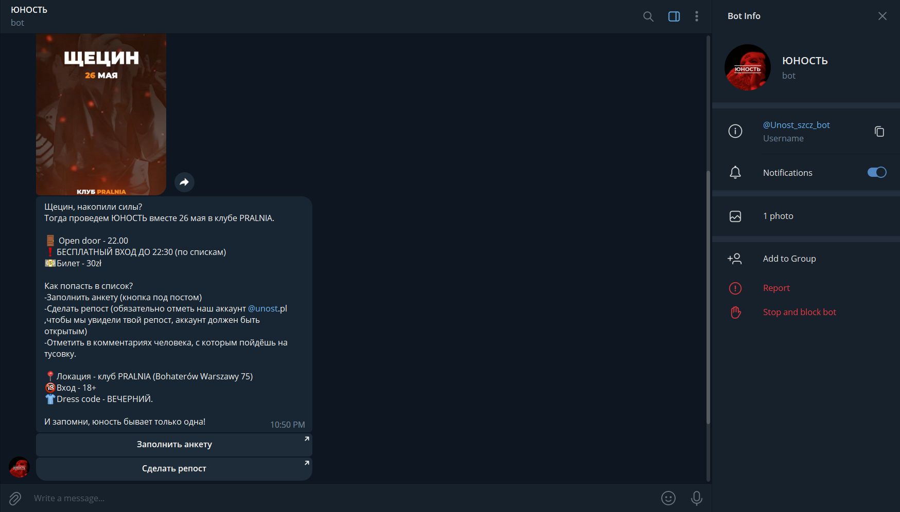
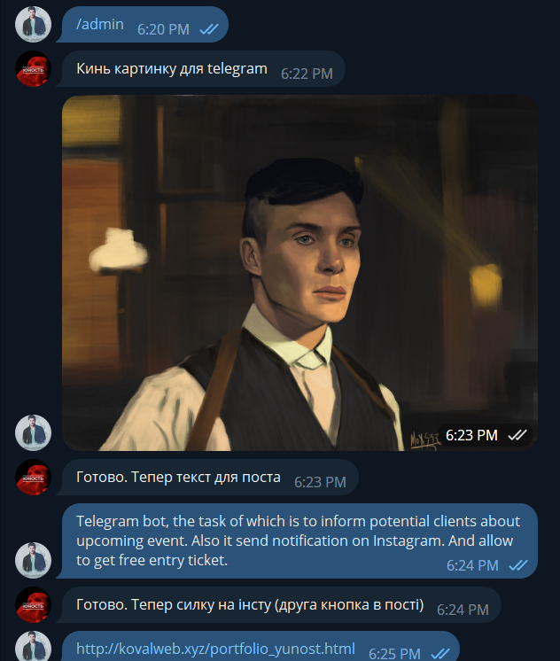
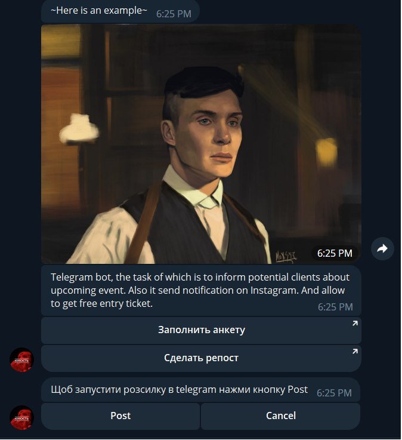

# Yunost

## Description
A Telegram bot designed to inform potential guests about upcoming events and automate Instagram notifications. It fetches user lists dynamically via the Google Sheets API and allows users to claim free entry tickets.

## Screenshots

## Technologies used
- Python
- aiogram
- Selenium
- Google Cloud API

## Installation

1. **Install Python**: Download and install Python (3.8+) from the official website.

2. **Install Mozilla Firefox**: Download and install Firefox browser from the official website. Install it on system **not** virtual environment!

3. **Install Requirements**: Run `pip install -r requirements.txt` in your command line to install the required dependencies.

4. **Deploy Google Spreadsheet**: Set up your spreadsheet according to your requirements.
	- https://www.youtube.com/watch?v=bu5wXjz2KvU

5. **Set Environment Variables**: Set the following environment variables:
   - `TOKEN` = bot_token_fron_botfather
   - `INSTA_LOG` = login_for_instagram_account
   - `INSTA_PASS` = password_for_instagram_account

6. **Run main.py**: Execute `python main.py` in your command line to run the main Python script.
